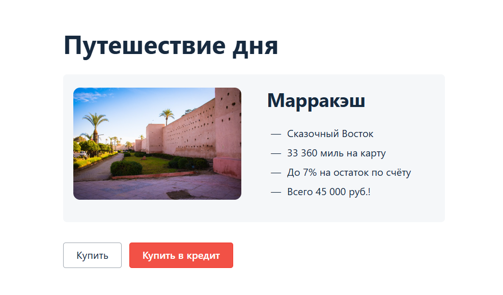

# Веб-сервис "Путешествие дня"
## Бизнес часть:
Приложение — это веб-сервис, который предлагает купить тур по определённой цене двумя способами:
1. Оплата по дебетовой карте (Payment Gate)
2. Оформление кредита по банковской карте (Credit Gate) — уникальный механизм, имитирующий оформление кредита без авторизации пользователя в банке.



## Архитектура приложения:
- Frontend: реализован в виде веб-интерфейса, предоставляющего форму ввода данных карты.
- Backend (SUT): приложение не обрабатывает банковские данные, а проксирует их в сторонние сервисы.
- База данных: PostgreSQL или MySQL на выбор — используется для сохранения результатов операций (успешно/неуспешно, способ оплаты).

*Данные карты в БД не сохраняются в соответствии с требованиями безопасности (имитация соблюдения PCI DSS).*


## Технические детали:
Приложение расположено в файле [aqa-shop.jar](https://github.com/vobukhova95/aqa-qamid-diplom/blob/main/artifacts/aqa-shop.jar) и запускается на порту `8080`.
Конфигурация (файл [application.properties](https://github.com/vobukhova95/aqa-qamid-diplom/blob/main/application.properties)) включает:
- параметры подключения к СУБД;
- адреса банковских симуляторов;


## Банковские сервисы:
Взаимодействие с банком реализовано через симулятор банковских сервисов, запущенный по адресу:
`http://185.119.57.197:9999`

Все запросы логируются и доступны в режиме реального времени здесь:
`http://185.119.57.197:9998`

Для анализа логов по своему трафику необходимо использовать фильтрацию по IP.

Сервис обрабатывает только специальные номера карт:

`APPROVED карта — 1111 2222 3333 4444`

`DECLINED карта — 5555 6666 7777 8888`

Остальные параметры карты (месяц, год, CVC, владелец) могут быть любыми, соблюдая простые валидационные правила.

Симулятор объединяет два сервиса:

`Payment Gate — обработка дебетовых платежей`

`Credit Gate — симуляция выдачи кредита`


## Инструкция по запуску приложения
### Предварительные требования
Перед запуском убедитесь, что на вашем компьютере установлены:
- Java 11 (Amazon Corretto)
- IntelliJ IDEA
- Docker и Docker Compose
- Git

### 1. Клонирование проекта с GitHub
```
git clone https://github.com/vobukhova95/aqa-qamid-diplom
cd aqa-qamid-diplom
```

### 2. Запуск базы данных PostgreSQL в Docker
В корне проекта есть файл [docker-compose.yml](https://github.com/vobukhova95/aqa-qamid-diplom/blob/main/docker-compose.yml). Он содержит настройки для запуска контейнера PostgreSQL.

Запуск контейнера:
```
docker compose up
```
Контейнер будет запущен на порту 5432. Используются следующие параметры:
- DB name: app
- Username: user
- Password: pass

Том для хранения данных будет смонтирован в папку ./pgdata.


### 3. Запуск приложения (SUT)
Приложение запускается стандартным способом через терминал:
```
java -jar artifacts/aqa-shop.jar
```

### 4. Запуск автотестов
```
./gradlew clean test
```